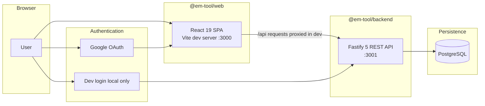
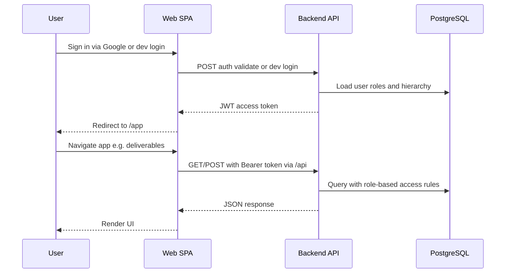

# Architecture

The Engineering Manager Tool is a TypeScript monorepo managed with Lerna and npm
workspaces. Two packages share one repository root and are developed and deployed
together.

## System overview



In local development, the web dev server proxies `/api` to the backend and strips
the `/api` prefix before forwarding. The browser always talks to port 3000; API
traffic reaches port 3001 through that proxy.

In production, sign-in uses Google OAuth. For local testing without Google
accounts, optional dev login is available — see
[development-login.md](development-login.md).

## Packages

| Package            | Role                                            | Stack                         | Default port |
| ------------------ | ----------------------------------------------- | ----------------------------- | ------------ |
| `@em-tool/web`     | Single-page application, routing, UI            | React 19, Vite 8, Material UI | 3000         |
| `@em-tool/backend` | REST API, auth, business logic, database access | Fastify 5, TypeORM            | 3001         |

## Repository layout

```text
engineering-manager-tool/
├── packages/
│   ├── web/                 # Frontend SPA (src/, vite.config.ts)
│   └── backend/             # API server (src/, database/migrations, database/seeds)
├── doc/                     # Technical documentation
├── specs/                   # Feature specifications (Spec Kit)
├── package.json             # Workspace root scripts (dev, test, lint, build)
└── lerna.json
```

Root scripts (`npm run dev`, `npm run test`, etc.) delegate to both packages via
Lerna.

## Data and auth flow



Authorization rules are enforced on the backend. Roles (`COLLABORATOR`, `LEADER`,
`ADMINISTRATOR`) and reporting hierarchy (`users.leader_id`) come from
PostgreSQL; the web app only exposes menu routes allowed for the signed-in user.

## Related docs

- [Getting started](getting-started.md) — first-time setup (run the stack locally)
- [Lerna](lerna.md) — day-to-day commands
- [Development login](development-login.md) — local auth bypass
